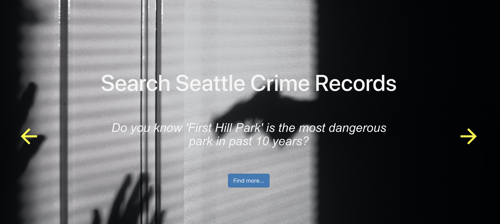
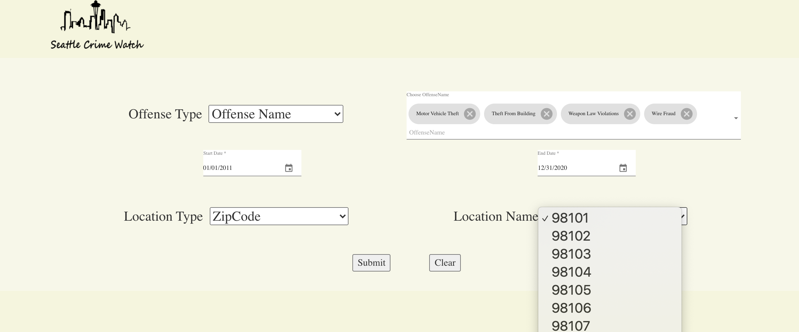
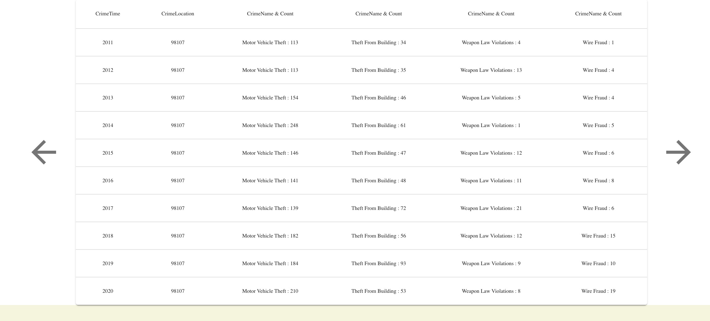
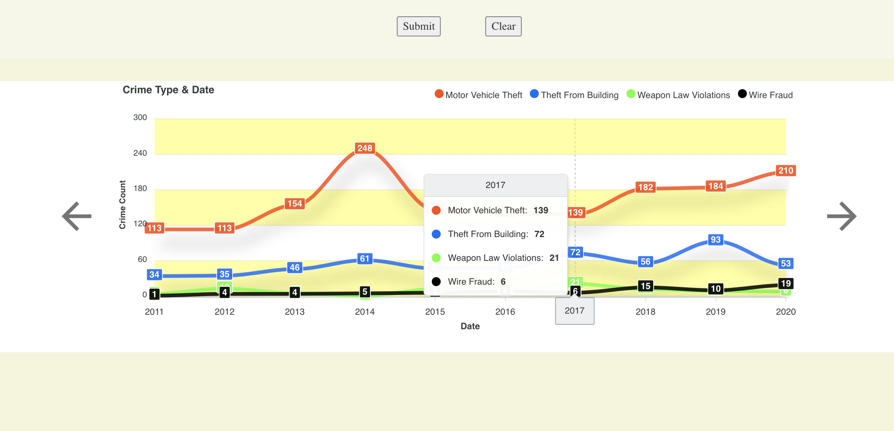

# seattle-crime-observe-app
Seattle Crime Observation App (The app can be accessed at: http://ec2-3-95-207-17.compute-1.amazonaws.com:8080)

· Published a website for users to search and view time, location and trend of all crime activities in Seattle

· Fulfilled RESTful CRUD operations with Spring Boot, JPA and MySQL, supplemented with React as view

· Analyzed the correlation between crime and social-economic activities to provide safety suggestions to the user

· Deployed the Java web app with AWS EC2 & S3 and stored MySQL database with Amazon RDS 

The application enables the user to find updated crime information in Seattle. User can search the crimes based on categories, groups or detailed crime names. Also, user can choose the time period (from 2011 - 2020) and type of location (zipcode & MCPP) in search operation. The key feature is that user is able to choose as many crimes as he/she want, to make comparisons. 

Welcome Page

Choose the crime details to performing the searching operation

Check the results in tabular form

View the chart

